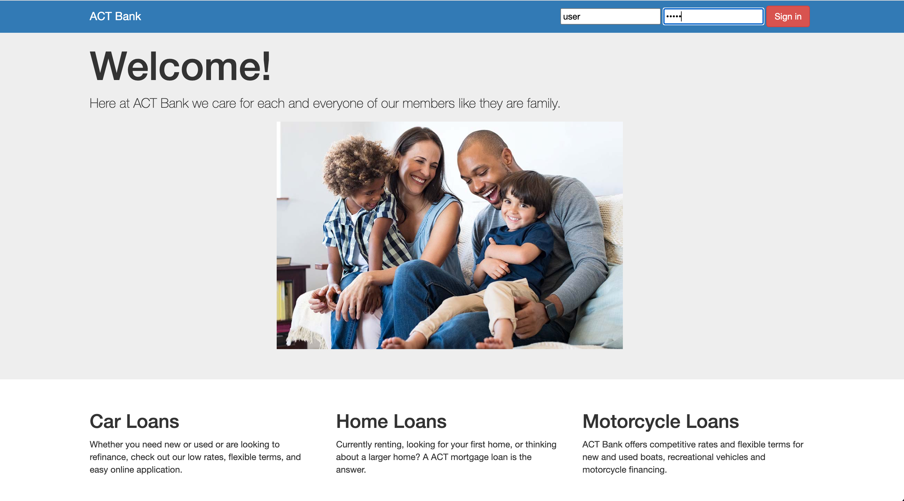
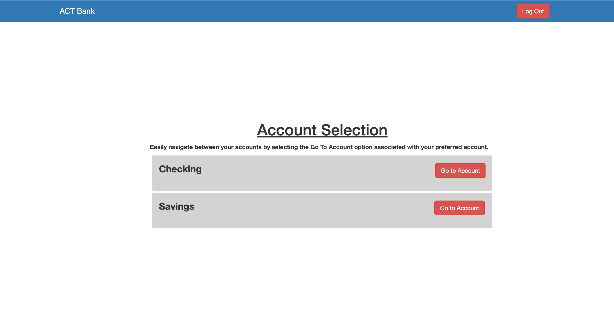
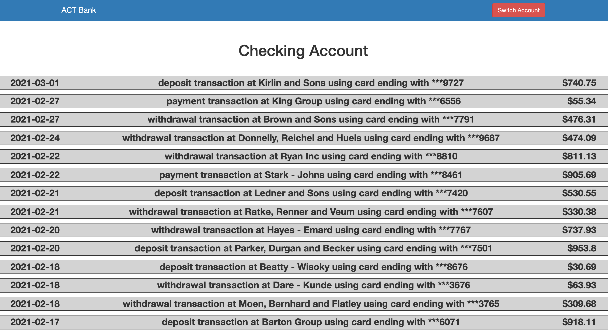

# ACT Bank

# Description

A simple online banking website which allows the user to login and view the transaction history. In this web page, you are able to use your own transactions that can be linked from MySQLWorkbench to the website as a sample on how bank websites work. In can aslo organize each transactions from your latest transactions in order.

# Preview

# Technologies Used

  HTML - CSS - JavaScript 
 
 Node - MySQL - Express - Sequelize - Handlebars - Heroku

 
 # User Story

 As a user 
 I WANT to login my account and view my checking and savings account
 
 SO THAT i can view all the transactions for individual accounts.

 # GitHub Repo

 https://github.com/SmasherCoder/bank.git

 # Heroku 
 https://act-bank.herokuapp.com/

 contact us for demo login

 # Testing 

 There are currently no testing procedures for this application

